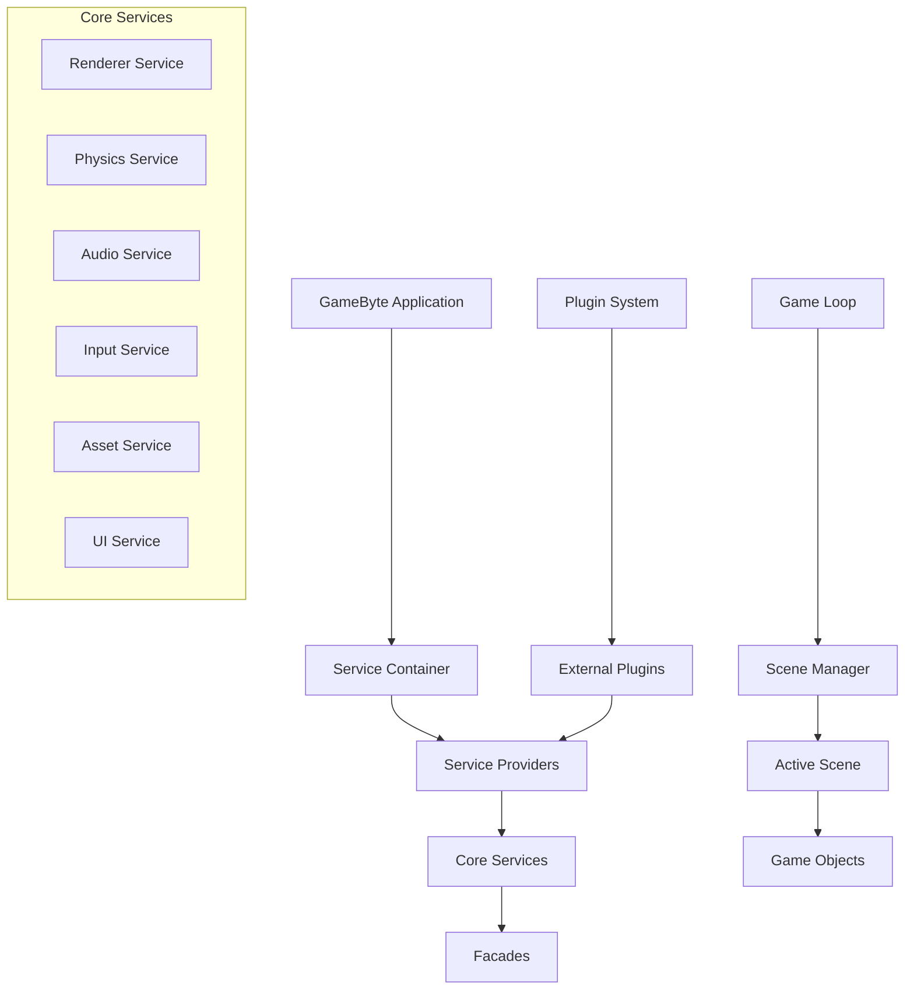

# Framework Architecture

GameByte Framework is built on Laravel-inspired architectural patterns, providing a robust foundation for mobile game development. This document explains the core architectural concepts and how they work together to create a maintainable, scalable game engine.

## Architectural Overview

GameByte Framework follows the **Inversion of Control (IoC)** principle, using dependency injection and service-oriented architecture to create loosely coupled, testable code.



## Core Components

### 1. GameByte Application

The `GameByte` class is the heart of the framework, orchestrating all services and managing the application lifecycle.

```typescript
import { GameByte } from '@gamebyte/framework';

// Create application instance
const app = GameByte.create();

// Register service providers
app.register(new CustomServiceProvider());

// Boot the application
await app.boot();

// Initialize with canvas
await app.initialize(canvas, RenderingMode.PIXI_2D);

// Start game loop
app.start();
```

#### Key Responsibilities:
- **Service Registration**: Register and resolve services through the IoC container
- **Lifecycle Management**: Handle application boot, initialization, and shutdown
- **Event Coordination**: Emit and listen to application-wide events
- **Plugin Management**: Load and manage framework plugins

### 2. Service Container (IoC Container)

The Service Container manages dependency injection and service resolution, inspired by Laravel's container.

```typescript
// Binding services
app.bind('custom.service', () => new CustomService());
app.singleton('global.cache', () => new CacheService());

// Resolving services
const service = app.make<CustomService>('custom.service');
const cache = app.make<CacheService>('global.cache');
```

#### Container Features:
- **Dependency Injection**: Automatic resolution of constructor dependencies
- **Singleton Management**: Single instance services across the application
- **Interface Binding**: Bind interfaces to concrete implementations
- **Contextual Binding**: Different implementations based on context

### 3. Service Providers

Service Providers are the primary way to register services with the framework, following Laravel's service provider pattern.

```typescript
import { AbstractServiceProvider, GameByte } from '@gamebyte/framework';

export class GameServiceProvider extends AbstractServiceProvider {
  register(app: GameByte): void {
    // Register services
    app.bind('game.manager', () => new GameManager());
    app.singleton('score.service', () => new ScoreService());
  }
  
  async boot(app: GameByte): Promise<void> {
    // Bootstrap services after all providers are registered
    const gameManager = app.make<GameManager>('game.manager');
    await gameManager.initialize();
  }
}

// Register the provider
app.register(new GameServiceProvider());
```

#### Provider Lifecycle:
1. **Registration Phase**: Services are bound to the container
2. **Boot Phase**: Services are initialized and configured
3. **Runtime Phase**: Services are resolved and used

### 4. Facades

Facades provide a static interface to services registered in the IoC container, offering clean, expressive APIs.

```typescript
import { Renderer, Physics, Audio, Scenes } from '@gamebyte/framework';

// Static access to services
await Renderer.initialize(canvas, options);
Physics.createBody(bodyConfig);
Audio.playMusic('background.mp3');
await Scenes.switchTo('gameplay');
```

#### How Facades Work:
```typescript
// Facade implementation (simplified)
export class Renderer extends Facade {
  protected static getFacadeAccessor(): string {
    return 'renderer.service';
  }
  
  static async initialize(canvas: HTMLCanvasElement, options?: any): Promise<void> {
    const renderer = this.getFacadeRoot<RendererService>();
    return renderer.initialize(canvas, options);
  }
}
```

## Service Architecture

### Core Service Structure

All framework services follow a consistent interface pattern:

```typescript
// Service interface
export interface RendererService {
  initialize(canvas: HTMLCanvasElement, options?: RendererOptions): Promise<void>;
  start(): void;
  stop(): void;
  resize(width: number, height: number): void;
  destroy(): void;
}

// Service implementation
export class PixiRendererService implements RendererService {
  private app: PIXI.Application | null = null;
  
  async initialize(canvas: HTMLCanvasElement, options?: RendererOptions): Promise<void> {
    this.app = new PIXI.Application({
      view: canvas,
      ...options
    });
    
    await this.app.init();
  }
  
  // ... other methods
}
```

### Service Registration Pattern

Services are registered through providers using consistent naming conventions:

```typescript
export class RenderingServiceProvider extends AbstractServiceProvider {
  register(app: GameByte): void {
    // Core renderer service
    app.bind('renderer.service', () => {
      const mode = app.make<string>('rendering.mode');
      return RendererFactory.create(mode);
    });
    
    // Renderer factory
    app.singleton('renderer.factory', () => new RendererFactory());
    
    // Rendering configuration
    app.singleton('rendering.config', () => new RenderingConfig());
  }
}
```

## Scene Management Architecture

### Scene Lifecycle

Scenes follow a predictable lifecycle managed by the Scene Manager:

```typescript
interface Scene {
  readonly id: string;
  readonly name: string;
  isActive: boolean;
  
  // Lifecycle methods
  initialize(): Promise<void>;
  activate(): void;
  deactivate(): void;
  update(deltaTime: number): void;
  render(renderer: any): void;
  destroy(): void;
}
```

### Scene Manager

The Scene Manager orchestrates scene transitions and lifecycle:

```typescript
export class SceneManager {
  private scenes: Map<string, Scene> = new Map();
  private activeScene: Scene | null = null;
  private transitionQueue: SceneTransition[] = [];
  
  add(scene: Scene): void {
    this.scenes.set(scene.id, scene);
  }
  
  async switchTo(sceneId: string, transition?: TransitionConfig): Promise<void> {
    const newScene = this.scenes.get(sceneId);
    if (!newScene) throw new Error(`Scene ${sceneId} not found`);
    
    // Handle transition
    if (this.activeScene) {
      await this.performTransition(this.activeScene, newScene, transition);
    } else {
      await this.activateScene(newScene);
    }
  }
  
  private async performTransition(
    from: Scene, 
    to: Scene, 
    config?: TransitionConfig
  ): Promise<void> {
    // Deactivate current scene
    from.deactivate();
    
    // Perform transition effect (fade, slide, etc.)
    if (config) {
      await this.executeTransition(config);
    }
    
    // Cleanup old scene if needed
    if (config?.destroyPrevious) {
      from.destroy();
      this.scenes.delete(from.id);
    }
    
    // Activate new scene
    await this.activateScene(to);
  }
}
```

## Plugin Architecture

### Plugin System Design

GameByte Framework supports a modular plugin system for extending functionality:

```typescript
// Plugin interface
export interface Plugin {
  readonly name: string;
  readonly version: string;
  readonly dependencies?: string[];
  
  install(app: GameByte): void;
  uninstall?(app: GameByte): void;
}

// Plugin implementation example
export class AnalyticsPlugin implements Plugin {
  readonly name = 'analytics';
  readonly version = '1.0.0';
  readonly dependencies = ['core'];
  
  install(app: GameByte): void {
    // Register analytics service
    app.singleton('analytics.service', () => new AnalyticsService());
    
    // Register event listeners
    app.on('scene:switched', this.trackSceneChange);
    app.on('player:action', this.trackPlayerAction);
  }
  
  private trackSceneChange = (event: any) => {
    // Track scene changes
  };
  
  private trackPlayerAction = (event: any) => {
    // Track player actions
  };
}
```

### Plugin Manager

The Plugin Manager handles plugin lifecycle and dependency resolution:

```typescript
export class PluginManager {
  private plugins: Map<string, Plugin> = new Map();
  private loadedPlugins: Set<string> = new Set();
  
  register(plugin: Plugin): void {
    this.plugins.set(plugin.name, plugin);
  }
  
  async load(pluginName: string): Promise<void> {
    const plugin = this.plugins.get(pluginName);
    if (!plugin) throw new Error(`Plugin ${pluginName} not found`);
    
    // Check dependencies
    if (plugin.dependencies) {
      for (const dep of plugin.dependencies) {
        if (!this.loadedPlugins.has(dep)) {
          await this.load(dep);
        }
      }
    }
    
    // Install plugin
    plugin.install(this.app);
    this.loadedPlugins.add(pluginName);
  }
}
```

## Event System

### Application Events

GameByte Framework uses an event-driven architecture for loose coupling:

```typescript
// Application-level events
app.on('initialized', () => console.log('App initialized'));
app.on('scene:switched', (from, to) => console.log(`Scene switched: ${from} -> ${to}`));
app.on('error', (error) => console.error('Application error:', error));

// Emit custom events
app.emit('player:scored', { score: 100, player: 'player1' });
```

### Service Events

Services can emit domain-specific events:

```typescript
export class PhysicsService extends EventEmitter {
  private world: PhysicsWorld;
  
  createBody(config: BodyConfig): PhysicsBody {
    const body = this.world.createBody(config);
    
    // Emit event
    this.emit('body:created', { body, config });
    
    return body;
  }
}

// Listen to service events
Physics.on('body:created', (event) => {
  console.log('Physics body created:', event.body.id);
});
```

## Configuration System

### Hierarchical Configuration

Configuration follows a hierarchical structure with environment-specific overrides:

```typescript
// config/app.ts
export default {
  name: 'My Game',
  version: '1.0.0',
  debug: process.env.NODE_ENV === 'development',
  
  rendering: {
    mode: '2d',
    width: 800,
    height: 600,
    backgroundColor: 0x000000,
    antialias: true
  },
  
  physics: {
    enabled: true,
    engine: 'matter',
    gravity: { x: 0, y: 9.82 },
    timestep: 1/60
  },
  
  audio: {
    masterVolume: 1.0,
    musicVolume: 0.7,
    sfxVolume: 0.8,
    spatialAudio: true
  }
};
```

### Configuration Loading

Configuration is loaded and merged during application boot:

```typescript
export class ConfigServiceProvider extends AbstractServiceProvider {
  register(app: GameByte): void {
    app.singleton('config', () => {
      const baseConfig = require('../config/app').default;
      const envConfig = this.loadEnvironmentConfig();
      
      return this.mergeConfig(baseConfig, envConfig);
    });
  }
  
  private loadEnvironmentConfig(): any {
    const env = process.env.NODE_ENV || 'development';
    try {
      return require(`../config/app.${env}`).default;
    } catch {
      return {};
    }
  }
}
```

## Performance Architecture

### Lazy Loading

Services and components are loaded on-demand to improve startup performance:

```typescript
export class AssetServiceProvider extends AbstractServiceProvider {
  register(app: GameByte): void {
    // Lazy-loaded asset service
    app.bind('asset.service', () => {
      return new AssetService(
        app.make('config.assets'),
        app.make('cache.service')
      );
    });
  }
}
```

### Object Pooling

Framework includes built-in object pooling for performance-critical objects:

```typescript
export class EntityPool<T> {
  private available: T[] = [];
  private active: Set<T> = new Set();
  private factory: () => T;
  
  constructor(factory: () => T, initialSize: number = 10) {
    this.factory = factory;
    
    // Pre-populate pool
    for (let i = 0; i < initialSize; i++) {
      this.available.push(factory());
    }
  }
  
  acquire(): T {
    let entity = this.available.pop();
    
    if (!entity) {
      entity = this.factory();
    }
    
    this.active.add(entity);
    return entity;
  }
  
  release(entity: T): void {
    if (this.active.has(entity)) {
      this.active.delete(entity);
      this.available.push(entity);
    }
  }
}
```

## Error Handling

### Centralized Error Handling

The framework provides centralized error handling with different strategies:

```typescript
export class ErrorHandler {
  handle(error: Error, context?: string): void {
    // Log error
    console.error(`[${context || 'APP'}] Error:`, error);
    
    // Report to analytics service if available
    const analytics = app.make('analytics.service');
    analytics?.reportError(error, context);
    
    // Show user-friendly error message
    if (error instanceof GameError) {
      this.showGameError(error);
    } else {
      this.showGenericError();
    }
  }
  
  private showGameError(error: GameError): void {
    // Show contextual error message
    UI.showNotification({
      type: 'error',
      message: error.userMessage || 'An error occurred'
    });
  }
}
```

### Custom Error Types

Framework defines specific error types for better error handling:

```typescript
export class GameError extends Error {
  public readonly userMessage?: string;
  public readonly code: string;
  
  constructor(message: string, code: string, userMessage?: string) {
    super(message);
    this.name = 'GameError';
    this.code = code;
    this.userMessage = userMessage;
  }
}

export class AssetLoadError extends GameError {
  constructor(assetPath: string) {
    super(
      `Failed to load asset: ${assetPath}`,
      'ASSET_LOAD_ERROR',
      'Failed to load game content. Please check your connection.'
    );
  }
}
```

## Summary

GameByte Framework's architecture provides:

1. **Modularity**: Services are loosely coupled and easily replaceable
2. **Testability**: Dependency injection makes unit testing straightforward
3. **Extensibility**: Plugin system allows for easy feature additions
4. **Maintainability**: Clear separation of concerns and consistent patterns
5. **Performance**: Lazy loading, object pooling, and optimized service resolution
6. **Scalability**: Architecture scales from simple games to complex projects

This architectural foundation enables developers to build professional-quality mobile games with clean, maintainable code that follows industry best practices.

## Next Steps

- [Service Container Deep Dive](./service-container.md)
- [Service Providers Guide](./service-providers.md)
- [Facades Documentation](./facades.md)
- [Application Lifecycle](./lifecycle.md)